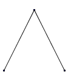

# Énigmes de rentrée

## Voyage en train

Chaque journée, il part un train de Paris vers Lyon à chaque heure pleine, puis toutes les dix minutes. Il en est de même entre Lyon et Paris. Le trajet entre les deux villes dure exactement deux heures. Lorsque je me rends de Paris à Lyon, combien de trains vais-je croiser durant mon voyage, en comptant éventuellement les trains que je peux croiser dans les deux gares ?

## Les châteaux de cartes

  Savez-vous construire des châteaux de cartes. Avec un étage, c'est très simple :
  

Avec deux étages, ce n'est pas beaucoup plus compliqué :

Mais alors, avec un jeu de 52 cartes, combien d'étages au maximum peut comporter un château de cartes ?

## Le rugby

Au rugby, on peut marquer 3 points (passer une pénalité), 5 points (marquer un essai), auquel cas on peut encore marquer 2 points supplémentaires ou non, si l'essai est transformé.
Quels sont les totaux de points que l'on peut réaliser?

## L'âge de nos enfants

Voici le dialogue quelque peu saugrenu que j'ai surpris un jour entre deux mathématiciens Alexandre et Bertrand.
A: Au fait, quel est l'âge de tes 3 enfants?
B: Le produit de leurs âges est de 36.
A: Je ne vois pas.
B: Par un étrange hasard, la somme de leurs âges vaut la moitié du tien.
A: Je ne peux toujours pas conclure.
B: L'aîné s'est cassé la jambe lundi dernier.
A: Parfait. Maintenant, je sais quels sont leurs âges.

Et vous????

### Au cm1

La maîtresse range ses élèves en rang par 2 avant de les faire rentrer en classe. Elle constate que chaque rangée contient autant de filles que de garçons. Plus surprenant, quand les enfants rentrent, elle constate qu'il y a autant de paires mixtes que de paires de même sexe qui ont été constituées. Combien la classe comporte-t-elle d'élèves, sachant qu'il y en a entre 20 et 30.

## Les poignées de mains

Quelle formidable soirée! Tout le monde repart ravi, en couple. Avec tous ses départs, 112 poignées de mains sont échangées. Mais combien y-avait-il de personnes dans cette soirée?

## Le troupeau

Un jour qu'un jeune homme (de moins de 20 ans) gardait le troupeau de ruminant de sa grand'ma, il se fit cette réflexion : c'est marrant, mais si je forme le produit du nombre de bêtes par le nombre de bêtes moins une, c'est exactement égal à la somme de 15 et du produit de mon âge par le nombre de têtes de bétail moins 2. Mais quel était son âge?

## Les tiroirs

300 personnes sont devant 300 tiroirs, numérotés de 1 à 300.

La première ouvre tous les tiroirs
La seconde ferme les tiroirs pairs
La troisième ouvre les tiroirs multiples de 3 qui sont fermés, et ferme les tiroirs multiples de 3 qui sont ouverts.
La quatrième ouvre les tiroirs multiples de 4 qui sont fermés, et ferme les tiroirs multiples de 4 qui sont ouverts.
La cinquième.....
Quand tout le monde est passé, quels sont les tiroirs ouverts?

## Défi avec les nombres premiers

Véro et Fred jouent ensemble à un jeu qui consiste à choisir un nombre entier compris entre 1 et 7, et à l'ajouter au total précémment obtenu. Le premier qui ne peut plus former un nombre premier a perdu. Véro commence. A-t-elle une stratégie qui lui permet de gagner?

Les premiers nombres premiers sont :
2 - 3 - 5 - 7 - 11 - 13 - 17 - 19 - 23 - 29 - 31 - 37 - 41 - 43 - 47 - 53 - 59 - 61 - 67 - 71 - 73 - 79 - 83 - 89 - 97
